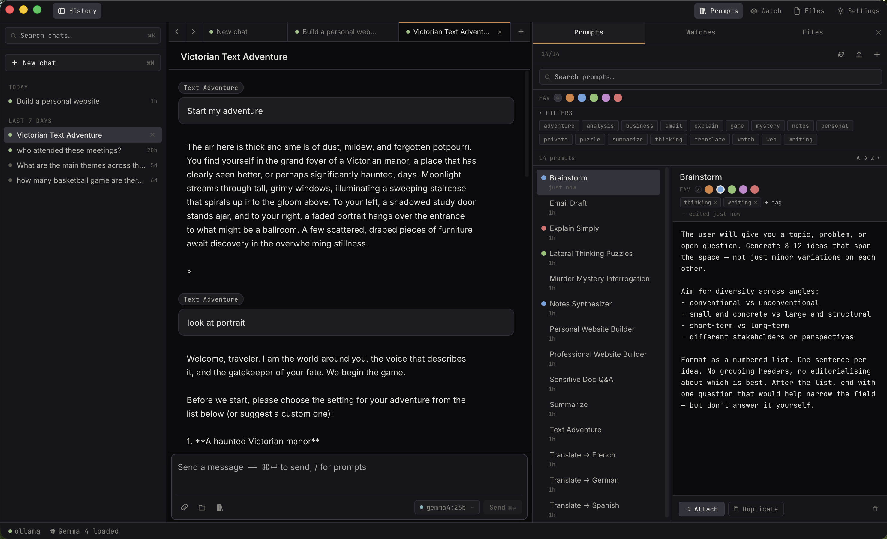

# Ekorbia — Local AI Integrated Productivity Environment

[](LICENSE)


A native desktop Integrated Productivity Environment (IPE) for local AI models powered by [Ollama](https://ollama.com). Ekorbia runs entirely on your machine — no cloud, no API keys.

<p align="center">
  
</p>

## Requirements

- **A supported desktop OS:**
  - **macOS 12 (Monterey) or newer** — full feature set, primary
    platform.
  - **Linux** — Ubuntu 22.04+, Fedora 39+, or any distro with a recent
    WebKitGTK 4.1. The quick-query overlay and one-keystroke screenshot
    capture are not yet wired up on Linux (see [Platform feature
    matrix](#platform-feature-matrix) below); everything else works.
  - **Windows 10 1809+ or Windows 11** — full feature set except the
    one-keystroke screenshot capture (planned).
- **[Ollama](https://ollama.com) installed and running** — `ollama serve`
  on `http://localhost:11434`. The Ekorbia installer does not bundle
  Ollama; install it separately.
- **At least one chat model pulled**, e.g.:
  ```bash
  ollama pull llama3.2:3b           # small, fast, general-purpose
  ollama pull gemma3:4b             # vision-capable (sees attached images)
  ollama pull nomic-embed-text      # for folder RAG / search
  ```
- **~8 GB free RAM** for the recommended models. Smaller models will
  run on less; larger ones need more.

## Platform feature matrix

| Feature | macOS | Linux | Windows |
|---|:---:|:---:|:---:|
| Chat (single + compare modes) | ✅ | ✅ | ✅ |
| Attachments + folder RAG | ✅ | ✅ | ✅ |
| Watches (folder / RSS / URL) | ✅ | ✅ | ✅ |
| OS-native notifications | ✅ | ✅ (libnotify) | ✅ (WinToast) |
| Prompt library | ✅ | ✅ | ✅ |
| Memory file | ✅ | ✅ | ✅ |
| Chat-tool file saves | ✅ | ✅ | ✅ |
| Full-text history search | ✅ | ✅ | ✅ |
| Quick-query overlay (Spotlight-style) | ✅ | — | ✅ |
| Screenshot capture (one keystroke) | ✅ | — | — |

A "—" means the feature isn't shipped on that platform yet. Linux overlay support and Linux/Windows screenshot capture are on the roadmap.

## Install

Download the bundle for your OS from the
[Releases page](https://github.com/ekorbia/ekorbia-desktop/releases). All
builds are unsigned, so each platform has a one-time bypass dance
documented below.

### macOS

Open the `.dmg` and drag **Ekorbia.app** into your Applications folder.

Ekorbia is **not** signed with an Apple Developer ID certificate (the
project doesn't carry a paid Apple Developer membership). macOS
Gatekeeper will refuse to open it on first launch. Depending on which
step you're at, you'll see one of two messages — both have the same
root cause (the browser tagged the download with a quarantine
attribute) and the same fix.

**If the `.dmg` itself won't open** — message reads `"Ekorbia_…dmg" is damaged and can't be opened. You should move it to the Trash.`

The file isn't actually damaged. Your browser quarantined it, and
because the bundle is unsigned, Gatekeeper refuses outright instead of
showing a bypass dialog. Strip the quarantine flag in Terminal:

```bash
xattr -dr com.apple.quarantine ~/Downloads/Ekorbia_*.dmg
```

Then double-click the `.dmg` — it mounts normally — and drag
`Ekorbia.app` into `/Applications`.

> If `xattr` prints `No such xattr`, the file really is corrupted.
> Re-download from the Releases page and verify the SHA256 against
> `SHA256SUMS.txt` (also on the release page):
> `shasum -a 256 -c SHA256SUMS.txt`

**If the `.app` won't open after installing** — message reads `"Ekorbia.app" cannot be opened because the developer cannot be verified.`

Pick one:

- **Right-click → Open**: in Finder, **right-click** (or Control-click)
  `Ekorbia.app` in `/Applications` and choose **Open**. The dialog now
  has an **Open** button — click it. macOS remembers your choice.
- **Strip quarantine in Terminal**:
  ```bash
  xattr -dr com.apple.quarantine /Applications/Ekorbia.app
  ```

Either approach is one-time; future launches work normally.

If you'd rather not run unsigned binaries, you can [build from source](#build-from-source)
instead — the source build produces a locally-signed binary that
Gatekeeper trusts.

### Linux

Three bundle formats are published per release:

- **AppImage** — works on any modern x86_64 distro, no install needed.
- **`.deb`** — Debian, Ubuntu, Mint, Pop!_OS, and other apt-based
  distros.
- **`.rpm`** — Fedora (Workstation, KDE, Silverblue), RHEL 9+, Rocky,
  Alma, and other dnf/rpm-based distros.

**AppImage** (simplest, distro-agnostic):

```bash
chmod +x Ekorbia_*_amd64.AppImage
./Ekorbia_*_amd64.AppImage
```

The first run may take a couple of seconds while the bundle extracts
itself into `~/.cache/`. Put the file anywhere in `$PATH` if you want a
shell-callable name.

**`.deb` (apt-based distros):**

```bash
sudo apt install ./ekorbia_*_amd64.deb
ekorbia
```

The package's runtime dependencies (`libwebkit2gtk-4.1-0`, `libgtk-3-0`)
are pulled in automatically. After install, you'll find Ekorbia under
your application launcher's "Utility" or "Development" category.

**`.rpm` (Fedora / RHEL / openSUSE):**

```bash
sudo dnf install ./Ekorbia-*.x86_64.rpm
ekorbia
```

The package depends on `webkit2gtk4.1` and `gtk3`, which Fedora 39+ and
RHEL 9+ have in their default repos. On older Fedora releases the
package name was `webkit2gtk3` — install it first
(`sudo dnf install webkit2gtk3`) and then `dnf install --force` the
Ekorbia rpm if the dependency check fails. Once installed, the app
shows up in KDE's launcher (Plasma searches by name) or under the
GNOME Activities overview.

**Notes:**

- Linux builds are produced on Ubuntu 22.04, which pins glibc 2.35 — so
  the bundles also run on older distros (Debian 12, RHEL 9, etc.) with
  WebKitGTK 4.1 available.
- The quick-query overlay and screenshot-capture hotkeys are **not**
  wired up on Linux in this release. See the [feature
  matrix](#platform-feature-matrix). Everything else — chat,
  attachments, watches, notifications, file saves — works the same as
  on macOS.
- OS notifications use libnotify (D-Bus). GNOME and KDE handle these
  natively; tiling window managers may need a notification daemon
  (`dunst`, `mako`, etc.) running.

### Windows

Two installers are published per release:

- **`.msi`** — the standard Windows installer. Right-click → Install.
- **`.exe` (NSIS)** — alternative installer with a slightly smaller
  download. Same end result.

Ekorbia is **not** code-signed (no EV certificate), so Windows
SmartScreen will warn on first launch:

> **Windows protected your PC** — Microsoft Defender SmartScreen
> prevented an unrecognized app from starting.

Click **More info**, then **Run anyway**. Windows remembers your choice
for that binary — future launches go through silently.

If you'd rather avoid the warning entirely, [build from source](#build-from-source)
(the local toolchain produces a binary SmartScreen ignores).

**WebView2 runtime:** The installer embeds the WebView2 bootstrapper, so
on Windows 10 systems that don't already have WebView2 (it's preinstalled
on Win11), the installer will silently download and install the runtime
during setup. No manual step required.

## Build from source

Prerequisites are platform-specific. Pick your row:

| OS | Toolchain | System libraries |
|---|---|---|
| macOS | [Rust stable](https://rustup.rs) | Xcode Command Line Tools (`xcode-select --install`) |
| Linux | Rust stable | See "Linux build deps" below |
| Windows | Rust stable + MSVC build tools | WebView2 runtime (preinstalled on Win11) |

You'll also want [`tauri-cli`](https://tauri.app/start/prerequisites/)
for the `cargo tauri` command — `cargo install tauri-cli --version '^2'`.
Node 20+ is optional and only needed if you plan to run the Playwright
test suite.

**Linux build deps** (Ubuntu / Debian — translate package names for your
distro):

```bash
sudo apt install libwebkit2gtk-4.1-dev \
  build-essential curl wget file libxdo-dev libssl-dev \
  libayatana-appindicator3-dev librsvg2-dev patchelf
```

**Build:**

```bash
git clone https://github.com/ekorbia/ekorbia-desktop.git
cd ekorbia-desktop/src-tauri
cargo tauri build
```

The bundles land under `src-tauri/target/release/bundle/<format>/`:

- macOS:   `bundle/macos/Ekorbia.app` and `bundle/dmg/Ekorbia_*.dmg`
- Linux:   `bundle/deb/ekorbia_*.deb` and `bundle/appimage/Ekorbia_*.AppImage`
- Windows: `bundle/msi/Ekorbia_*.msi` and `bundle/nsis/Ekorbia_*-setup.exe`

For development with hot-reload, use `cargo tauri dev` from the
`src-tauri/` directory.

## Features

- **Multi-tab chat** with independent conversation history per tab
- **Private chats** — click the lock icon next to "New chat" in the sidebar to open an ephemeral session. Messages, attachments, and file saves never touch the database; the conversation lives only in memory and disappears when the tab closes
- **Compare 2-3 models side-by-side** — click the columns icon next to the lock icon in the sidebar to start a comparison chat. Pick 2 or 3 installed models, send one prompt, and watch the responses stream into adjacent columns in parallel. Click "Keep this" on whichever response you prefer — the chat transitions to a normal single-model conversation with the kept model, and the unpicked responses are preserved under a "▸ N alternatives" disclosure for later inspection. See [docs/src/chat/compare.md](docs/src/chat/compare.md) for the full walkthrough.
- **File & folder attachments with local RAG**
  - Click the paperclip to attach `.txt` / `.md` / `.pdf` files or images, or the folder icon to attach an entire directory
  - Small files are inlined verbatim; large files and folders are chunked, embedded locally with [nomic-embed-text](https://ollama.com/library/nomic-embed-text) (or any embedding model you pull), and retrieved per-query
  - The folder walker filters by file type and skips noise (`.git`, `node_modules`, `target`, etc.); configurable in Settings
  - **Images** route through vision-capable models (Gemma 4, llava, etc.) as base64; a small "VISION" badge on the chip shows when the active model can see them
  - **Citations**: assistant replies emit `[N]` markers inline that match a Sources footer of clickable file chips. Folder chips expand to show which sub-files matched, with relevance scores. Shift-click any chip to reveal in Finder.
  - Incremental folder re-index — change one note in a 500-file folder, click ↻, and only that file is re-embedded
  - Live progress: chip shows `walking…` → `42/387` → `87 files`; aggregated indexing line in the status bar mirrors it
-  **Prompt library backed by Markdown files**
  - Prompts live as `.md` files with YAML frontmatter under `~/Documents/Ekorbia/Prompts/` — git-friendly, easy to share, editable in any editor
  - The folder is configurable in Settings (Browse / Reveal in Finder / Reset to default)
  - Five colored **Favorites** for quick personal-bucket filtering, assignable via right-click; favorite color is per-user (lives in local SQLite) so it doesn't travel with shared files
  - Flat free-text **tag filters** with full-text search across name, body, and tags
  - Sort by Recent / A→Z / Z→A / Favorite (defaults to A→Z)
  - Resizable list column (left half of the panel)
  - Import prompts from `.md` / `.txt` files
  - 28 built-in prompts ship with the app: Album Deep Dive, Brainstorm, Cliff Notes, Cloudflare Uptime Watcher, Cover Letter Writer, Devil's Advocate, Email Draft, Explain Simply, Google Cloud Uptime Watcher, How Does It End, Job Posting Watcher, Lateral Thinking Puzzles, Log Triage, Murder Mystery Interrogation, New Listing Watcher, Notes Synthesizer, Personal & Professional Website Builders, Price / Availability Watcher, Rental Watcher, Research Paper Tracker, Resume Coach, Sensitive Doc Q&A, Should I Watch This, Summarize, Text Adventure, Tone Reframer, Translate → Spanish / French / German, Wikipedia Edit Watcher
  - "Restore built-in prompts" button in Settings re-copies them if you've deleted any
- **Quick-query overlay** (⌘⇧Space on macOS, Alt+Space on Windows; customisable in Settings — *not available on Linux yet*)
  - Spotlight-style panel that pops up over any app — never steals focus from your work
  - Inline model and single-prompt pickers, with searchable prompt list
  - Streaming responses just like the main composer
  - **Send to main** → continue any overlay session as a full multi-turn chat in the main window
  - Auto-hides on blur (clicking elsewhere) or ⎋
- **Screenshot capture** (⌘⇧1 by default, customisable in Settings — *macOS only*)
  - Invokes macOS's native region selector (drag for a region, Space for a window, Esc to cancel) — the same UI you already know from `Cmd+Shift+4`
  - The captured PNG opens in a fresh chat tab with the image attached as a vision attachment
  - Auto-switches to a vision-capable model if your current model can't see images (and tells you via toast); warns if no vision model is available
- **Watch feature (ambient background work)** — three kinds, all writing into the same notes file
  - **Folder**: Ekorbia polls a chosen folder and summarises any new file (PDF / TXT / MD) that lands there
  - **RSS feed**: Polls an RSS or Atom feed; summarises each unseen entry. If the feed only ships a short teaser and a link, Ekorbia automatically follows the link and extracts the article body so summaries aren't paper-thin
  - **URL**: Polls an arbitrary public page and only summarises when its visible text actually changes. **Snapshot mode** sends the whole new page to the model; **Diff mode** sends a unified line diff of what changed since the last poll — ideal for release notes, changelogs, leaderboards, status pages
  - **Per-watch poll cadence**: folder=30s, RSS=10min, URL=30min by default, each tunable in the form. Manual "Run now" bypasses the cadence gate
  - **Optional CSS selector** on URL watches lets you narrow extraction past nav / footer noise (`article`, `main`, `.post-content`)
  - **Test button** in the watch form probes the feed/URL once and reports entry count or extracted character count — catches typos before saving
  - **Edit watches** — pencil icon on each watch row reopens the form pre-filled so you can change the name, prompt, model, cadence, or any other field without deleting and re-creating
  - **OS notifications** — per-watch opt-in toggle in the form sends a native OS notification (macOS Notification Center, Linux libnotify, Windows toast) when new events arrive. Multiple events from one poll cycle are coalesced into a single banner ("8 new items from My Folder"). Watches with notifications enabled show a 🔔 glyph in the list. On macOS the form explains the permission request before the OS dialog fires.
  - Right-panel "Watches" tab shows the activity feed with live processing indicators and a kind glyph (📁 / 📡 / 🌐) per row
  - "Chat with notes" button opens a new chat with the accumulated notes injected as system context — ideal for asking questions across many summaries at once
- **Live Ollama model picker** — lists all locally pulled models, switch mid-session; your selection sticks across launches and auto-falls-back to an installed model if your previous pick is no longer pulled
- **Streaming responses** — assistant tokens appear as the model produces them; a **Stop** button mid-generation freezes whatever was written so far and marks the partial message as `Stopped` so you can see exactly where the cut-off happened
- **Markdown rendering** for assistant replies — headings, lists, tables, blockquotes, inline and fenced code, all rendered cleanly; **syntax-highlighted code blocks** via highlight.js (github-dark) with a per-block **Copy** button on hover. User messages stay as plain text so you see exactly what you typed
- **Edit & retry messages** — click the pencil icon on any past user message to edit and resend (the conversation truncates from that point so the model re-answers with your revision); click the retry icon on the last assistant reply to regenerate. The DB and FTS index stay consistent — no orphan rows
- **Chat export** — kebab menu in the chat header exports the conversation to **Markdown** (clean role-tagged sections, tool-call internals filtered out) or **JSON** (full row preservation including tool calls, timestamps, source attribution)
- **Memory file** — a single user-edited markdown file Ekorbia injects as a system message on every chat send. Read-only from the model's perspective; the `write_file` tool can't touch it. Path is configurable in Settings → Memory; defaults to `~/Documents/Ekorbia/memory.md`
- **Click-to-rename chats** — click the title in the ChatPane to edit inline; Enter saves, Esc cancels
- **Full-text search across chat history** — type in the sidebar search box to find matches in any past message; results are ranked by relevance (BM25), highlighted in-place, and clicking a hit opens the parent chat with the query terms highlighted there too
  - **Stale-embeddings banner** appears automatically if you change the embedding model in Settings, with a one-click "Re-index all" action
- **Chat-generated file saves**
  - Tool-capable models (gemma4, llama 3.1+, qwen 2.5+, …) can call a `write_file` tool to save any output file — HTML, CSS, JS, Python, configs, scripts — directly to a per-chat output directory you choose
  - A first-save permission modal prompts you to pick an output folder (pre-filled to `~/Library/Application Support/…/Outputs/<chat-slug>/`) or block saves entirely for that chat; the choice sticks and you can change it any time via the **Files** panel
  - The **Files** panel (third tab in the right sidebar, alongside Prompts and Watches) lists every file the model saved, grouped by path, with byte size, age, version count, and per-file **Reveal** and **Open** buttons; clicking a row scrolls the chat to the message that produced the save
  - Saved files are **atomic** (temp file + rename), so a crash mid-write leaves the previous version intact
  - A **TOOL** badge appears on the model picker when the active model supports tool use, so you always know which capability path is active
  - For models that don't use tool calls — or when the tool path is unavailable — fenced code blocks in assistant messages get per-block **Save** buttons that route through the same sandbox and permission flow (source tagged `manual` in the history log)
  - Every write is sandboxed to the chat's output directory; path-traversal attempts (`..`, absolute paths, symlink escapes) are rejected server-side with unit-tested rules
- **Tab strip with attachment indicator** — tabs with attached files show a small paperclip + count so you can see context coverage at a glance
- **History sidebar** with searchable chat history grouped by date, plus per-chat delete
- **Settings panel** (tabbed: General / Prompts / Memory / Attachments) exposes theme, density, status-bar toggle, overlay hotkey, screenshot hotkey, prompts folder, memory file path, embedding model, top-k chunk count, folder file types and ignore patterns, plus a **Show tour again** button to re-run the onboarding
- **First-launch onboarding tour** — a 5-slide intro covers the hotkeys, attachments, memory file, and prompts library on the very first launch. Skippable any time with ⎋, and re-openable later from Settings → General → Help → Show tour again
- **Toasts** for non-modal feedback (model not pulled, attachment errors, watch failures) — never blocks the UI
- **Ollama auto-start** — detects whether Ollama is running at launch and offers to start it; the main window keeps focus while Ollama boots
- **Status bar** that distinguishes *Ollama not running* / *model not pulled* / *cold* / *warming* / *loaded* states, plus an aggregated *Indexing docs/ — 42/87* line whenever any attachment is being indexed
- **Five themes** — One Dark, One Light, Ayu Dark, Ayu Mirage, Ayu Light
- **Persisted UI state** — sidebar width, right-panel width, prompt-list width, panel open/closed state, right-panel tab, selected model, hotkey, prompts folder, embedding model, top-k, folder filters, and theme all survive across launches
- **Local storage**
  - **Chats and messages**: SQLite database in the app's data directory. Path depends on OS:
    - macOS: `~/Library/Application Support/com.ekorbia.desktop/ekorbia.db`
    - Linux: `~/.local/share/com.ekorbia.desktop/ekorbia.db`
    - Windows: `%APPDATA%\com.ekorbia.desktop\ekorbia.db`
  - **Prompts**: Markdown files in your configured prompts folder
  - **Search index**: SQLite FTS5 virtual table, kept in sync with messages automatically via triggers
  - **Attachments**: file paths + metadata in SQLite; chunk embeddings stored as packed `f32` BLOBs (brute-force cosine retrieval — no extension required)

## Prerequisites (developer)

| Tool | Install |
|------|---------|
| [Rust](https://rustup.rs) (1.80+) | `curl --proto '=https' --tlsv1.2 -sSf https://sh.rustup.rs \| sh` |
| [Tauri CLI](https://tauri.app/start/prerequisites/) | `cargo install tauri-cli --version '^2'` |
| [Ollama](https://ollama.com) | Download from ollama.com |
| A chat model (any one) | `ollama pull gemma4:26b` (vision-capable) or `ollama pull llama3` |
| Embedding model (for attachments) | `ollama pull nomic-embed-text` |

Per-OS extras:

- **macOS**: Xcode Command Line Tools — `xcode-select --install`
- **Linux**: WebKitGTK 4.1 + a handful of supporting libs (see [Build
  from source → Linux build deps](#build-from-source))
- **Windows**: MSVC build tools (the [Visual Studio "Build Tools for
  C++" installer](https://visualstudio.microsoft.com/visual-cpp-build-tools/)
  covers it) and the WebView2 runtime (preinstalled on Win11; auto-
  installs on Win10 via the bootstrapper)

## Running in dev mode

```bash
git clone <repo-url>
cd ekorbia
cargo tauri dev
```

The app window opens automatically. The frontend in `ui/` hot-reloads on file save; Rust changes trigger a recompile and restart.

## Building a release executable

```bash
cargo tauri build
```

Bundle outputs land under `src-tauri/target/release/bundle/`:

```
# macOS
bundle/macos/Ekorbia.app
bundle/dmg/Ekorbia_*.dmg

# Linux
bundle/deb/ekorbia_*_amd64.deb
bundle/rpm/Ekorbia-*.x86_64.rpm
bundle/appimage/Ekorbia_*_amd64.AppImage

# Windows
bundle/msi/Ekorbia_*_x64_en-US.msi
bundle/nsis/Ekorbia_*_x64-setup.exe
```

`cargo tauri build` produces only the bundle formats supported by the
host OS — you can't cross-compile a `.dmg` from Linux. To produce all
three OS bundles for a release, push a `v*` tag and let the
[release workflow](.github/workflows/release.yml) fan out to the three
matrix runners.

## Switching models

Click the model name button in the bottom-right of the composer to open the model picker. It lists every model currently pulled in Ollama (queried live from `/api/tags` each time the picker opens). To add a model:

```bash
ollama pull <model-name>
```

Then reopen the picker — the new model appears immediately.

Your choice is **sticky across launches**: the composer remembers the last model you used and reopens to it. If the model you previously picked is no longer pulled (e.g. you ran `ollama rm` on it or moved to a new machine), Ekorbia silently falls back to the first available model at startup so the composer is always in a usable state.

The **quick-query overlay** keeps a separate model preference (under `ekorbia.overlay.model` in localStorage), so you can use a heavy reasoning model in the main window for in-depth chats and a small fast model in the overlay for quick lookups. Switch the overlay's model via the picker in its context bar; the main composer is unaffected.

When the active model supports tool use, a **TOOL** badge appears on the model picker button. Tool-capable models (gemma4, llama 3.1+, qwen 2.5+, …) can call `write_file` automatically during chat to save files to disk — see [Saving files from chat](#saving-files-from-chat).

A separate **VISION** badge appears on image attachment chips when the active model can see the attached image (gated per-query via `model_capabilities`).

## Attaching files and folders

Click the **paperclip** to attach individual files (`.txt`, `.md`, `.pdf`, `.png`, `.jpg`, `.jpeg`, `.webp`) or the **folder icon** to attach an entire directory tree.

**What happens behind the scenes:**

- **Small text files (under 8 KB)**: inlined verbatim into the next prompt. Zero indexing latency, full context.
- **Large text files and folders**: extracted, chunked (~1000 chars with 100-char overlap, paragraph-aware), and embedded with the model in *Settings → Attachments → Embedding model* (default `nomic-embed-text`). The chip shows live progress: `walking…` → `42/387` → `87 files`.
- **Images**: if the active chat model is vision-capable (e.g. Gemma 4, llava), the bytes get base64-encoded into the request. Otherwise, attaching is allowed but the model will ignore the image and the Sources footer notes that.
- **Folders**: respect the file-type allow-list (default: `.md`, `.txt`, `.pdf`) and the ignore-dir list (`.git`, `node_modules`, `target`, `dist`, `build`, `.venv`, etc.). Both are editable in Settings. Capped at 1000 files per folder.

**At send time**, Ekorbia embeds your question and retrieves the top 6 most relevant chunks across all attachments. The model gets the chunks as a system message with `[1]`, `[2]`, … citation indices, and is instructed to mark its references inline. The Sources footer under the reply shows clickable file chips matching those indices — folder chips expand to show which sub-files contributed and their relevance scores.

**Re-indexing a folder** (click the `↻` on a ready folder chip) is incremental: only files whose mtime has changed get re-embedded; unchanged files reuse their existing chunks.

**If you change the embedding model** in Settings, a yellow banner appears above the chat: *"N attachments were embedded with a different model. Re-index them with X to make them searchable again."* — one click handles the lot.

## Searching chat history

Start typing in the **search box at the top of the History sidebar**. After ~150 ms of idle time, Ekorbia searches across every message ever saved — user and assistant — and shows ranked results below the title matches in a "Messages" section. Each hit shows the parent chat title and a 3-line snippet with the matched words highlighted.

- **Multi-word queries** AND together — `code review` finds messages containing both
- **Prefix matching** is automatic — `interrog` matches "interrogation"
- **Punctuation is ignored** — `it's` searches the same as `its`
- **Clicking a hit** opens the parent chat with the same query terms highlighted in every message, so you can scan for context

## Watching folders, feeds, and URLs

Open the right-side **Watches** panel and click **+ Configure** to create a new watch, or click the **pencil icon** on an existing watch row to edit it. Pick a kind:

- **Folder** — Ekorbia scans the directory every 30 s (configurable). When a new `.pdf` / `.txt` / `.md` lands, it summarises the file and appends the summary to your notes file.

- **RSS feed** — Paste a feed URL (RSS 2.0, RSS 1.0, or Atom — all handled by `feed-rs`). Defaults to polling every 10 minutes. For each unseen entry, the summary uses whichever is longest of `<content>`, `<summary>`/`<description>`, or — when the feed only carries a teaser — the article body fetched from the entry's link. Click **Test** before saving to see how many entries the feed currently exposes.

- **URL** — Paste any public page. Defaults to polling every 30 minutes. Ekorbia fetches the page, strips HTML to text, and **only summarises if the visible text changed** since the last poll.
  - **Snapshot mode** (default): the whole current page goes to the model when something changes.
  - **Diff mode**: only the added/removed lines (unified diff, 3 lines of context) go to the model — useful when you mostly care about deltas (release notes, changelogs, leaderboards).
  - **Advanced → CSS selector**: optionally narrow extraction to a sub-tree (`article`, `main`, `.post-content`). If the selector matches nothing on a given poll, the whole page is used as a fallback so the watch doesn't silently break.

All three kinds share the same notes file, model, and (optional) summarisation prompt. The activity feed in the right panel shows kind glyph (📁 / 📡 / 🌐), source label, model, processing dots, and each event's full summary inline (click to expand truncated entries).

**Editing a watch**: click the pencil icon between the on/off toggle and the trash icon on any watch row. The form opens pre-filled; saving runs the same upsert so pipeline state (`last_content`, `last_polled_at`) is preserved — the next poll continues from where it left off rather than re-firing a baseline summary.

**OS notifications**: enable the *Notify* toggle in the watch form to receive a native OS notification whenever new events arrive. Multiple events from the same poll cycle are coalesced — e.g. five new files produces one "5 new items from My Folder" banner rather than five separate alerts. Watches with notifications on show a 🔔 in the list. On macOS the form shows an inline explainer before the OS permission dialog fires so you understand what you're granting.

**Note on URL watches**: the first fetch after creating a diff-mode watch always emits a full-page summary because there's nothing to diff against yet. Subsequent polls produce diff-only summaries.

## Saving files from chat

When you use a tool-capable model (look for the **TOOL** badge), the model can call `write_file` during the conversation to save any generated file to disk — HTML pages, Python scripts, config files, anything.

**First save**: the first time a model tries to save in a chat, a permission modal appears. You can:
- **Allow** — pick an output folder (pre-filled to the app's data directory's `Outputs/<chat-slug>/`: `~/Library/Application Support/com.ekorbia.desktop/Outputs/...` on macOS, `~/.local/share/com.ekorbia.desktop/Outputs/...` on Linux, `%APPDATA%\com.ekorbia.desktop\Outputs\...` on Windows)
- **Block** — prevents any saves for this chat (the model is told it can't save)
- **Not now** — skips this write only; the modal reappears on the next attempt

**Files panel**: open the third right-panel tab (the document icon in the title bar) to see all files saved in the current chat. Each row shows:
- Relative path, byte size, age, and version count if the model has overwritten a file
- **Reveal** to show the file in Finder; **Open** to open it with your default application
- Click the row to scroll the chat to the message that produced the save

**Heuristic fallback** (for models without tool support): fenced code blocks in assistant messages display a **Save** button. Ekorbia infers a filename from comment hints inside the block (e.g. `<!-- index.html -->`, `# main.py`) or falls back to the language tag. The same permission flow and output directory apply.

**Output dir management**: in the Files panel header you can click **Change…** to pick a new folder, **Reveal** to open the current folder in Finder, or **Block** to prevent any further saves for this chat.

## Exporting chats

Click the **kebab (⋯)** in the chat header for export options:

- **Export to Markdown** — a clean human-readable transcript with role-tagged sections (`## You`, `## Assistant`). Assistant messages keep their markdown intact; tool-call internals (`role: tool` rows) are filtered out so the export reads like a conversation, not a transcript with debug noise
- **Export to JSON** — every row in the conversation, including system context, tool calls, tool results, timestamps, and source attribution. Round-trips cleanly into other tools or scripts

Both options write to a path you pick via the standard save dialog. The export is read-only — your chat in Ekorbia stays untouched.

The kebab is hidden on private (ephemeral) chats since there's nothing to export.

## Memory file

A single user-edited markdown file Ekorbia injects as a system message on every chat send. Useful for habitual context you'd otherwise re-type into every prompt — facts about you, preferences, writing style, project conventions.

- **Default path**: `~/Documents/Ekorbia/memory.md`. Change it via **Settings → Memory → Choose file…**, or reset via **Reset to default**.
- **Edit memory** opens the file in your OS default text editor (creating it from a small template if it doesn't exist yet)
- **Read-only from the model's perspective** — the `write_file` tool cannot touch it; only you can edit it externally. This is deliberate: the memory is your shared context with the model, not something it gets to rewrite on its own
- **Soft cap at ~10 KB** — over that and an inline warning appears. The file's contents are added to *every* send, so token cost scales linearly with size

Memory is global, not per-chat. If you want chat-specific notes the model should see, use an attachment instead.

## Private chats

Click the **lock icon** beside "New chat" in the sidebar to open an ephemeral session. Messages, attachments, file saves — none of it touches the SQLite database. The conversation lives only in memory and disappears when you close the tab.

- The lock glyph appears on the tab and as a banner above the composer so a private chat is never visually confused with a persisted one
- The composer hides the **paperclip** and **folder** buttons — no attachments in private mode (they'd persist to disk via the attachment store, defeating the purpose)
- The export kebab is hidden too — there's nothing on disk to export from
- Useful for quick scratch work, sensitive prompts, anything you want to leave no trace of in the chat history

Switching the active tab away from a private chat doesn't destroy it — the conversation stays in memory until the tab itself closes.

## Capturing screenshots (macOS only)

> Screenshot capture is currently macOS-only. On Linux and Windows the
> Settings panel hides this row, and the hotkey isn't registered.
> Capture-on-keystroke for Linux and Windows is on the roadmap; until
> then, use your OS's native screenshot tool and drop the resulting
> file into Ekorbia via the paperclip attach button.

Press **⌘⇧1** (default; rebindable in Settings → General → Screenshot) anywhere to invoke macOS's native region selector — the same crosshair UI you already know from `Cmd+Shift+4`. Drag for a region, press **Space** to switch to window mode, or **Esc** to cancel.

When you complete a capture:

- A new chat tab opens automatically with the screenshot attached as a vision attachment
- If your current model can see images, you're good to go — type a question and send
- If your current model **can't** see images but a vision model is cached from earlier this session, Ekorbia switches to it and toasts *"Switched to vision model: <name>"*
- If no vision model is available at all, a toast warns you the image will be ignored — `ollama pull` one (e.g. `gemma3:4b`, `llava`) and reattach

The captured PNG is written to your system temp directory and referenced by path from the attachment store, so don't delete it before sending the first message. On macOS the OS reclaims temp files on reboot.

## Contributing

PRs are welcome. See [`CONTRIBUTING.md`](CONTRIBUTING.md) for the dev
setup, test gates, and architectural invariants that patches need to
respect. For bug reports and feature ideas, open a [GitHub Issue](https://github.com/ekorbia/ekorbia-desktop/issues).

If you're reporting a security vulnerability, please use GitHub's
private security advisory mechanism instead — see [`SECURITY.md`](SECURITY.md).

Larger architectural decisions and the rationale behind the codebase's
invariants live in [`CLAUDE.md`](CLAUDE.md) (originally written for AI
coding assistants, but the most authoritative "why is this code shaped
this way" reference in the repo).

## License

Ekorbia is released under the [MIT License](LICENSE).

Copyright (c) 2026 Ekorbia.

Third-party crate attributions are enumerated in [`THIRD_PARTY_LICENSES.md`](THIRD_PARTY_LICENSES.md). The front-end loads React, ReactDOM, Babel-standalone, marked, highlight.js, and DOMPurify from CDN (unpkg) and Google Fonts; none of those libraries are vendored into the repository.
