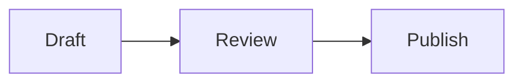

# Markdown and code blocks

Assistant replies in Ekorbia are rendered as **Markdown**. Your own messages stay as plain text — you see exactly what you typed.

This page is mostly about what the rendering supports and what the code-block UI gives you.

## What renders

The Markdown renderer supports the full common set:

- Headings (`#`, `##`, `###`, …)
- Bullet lists, numbered lists, nested lists
- **Bold**, *italic*, `inline code`, ~~strikethrough~~
- Blockquotes
- Tables with column alignment
- Inline links
- Fenced code blocks with language tags
- Horizontal rules

Anything potentially unsafe — `<script>` tags, `javascript:` links, inline event handlers — is **sanitized** before rendering. The assistant cannot inject code that runs in the app, no matter what it puts in its reply.

## Math

Replies can include real typeset math, rendered by KaTeX — entirely offline, like everything else in Ekorbia:

- **Inline**: `$E = mc^2$` or `\(E = mc^2\)` renders inside the sentence
- **Display**: `$$ \int_0^1 x^2\,dx = \tfrac{1}{3} $$` or `\[ … \]` gets its own centered line; long equations scroll sideways instead of overflowing

A few sensible guardrails: dollar amounts like `$5 and $10` stay ordinary text, and anything inside code blocks or `` `inline code` `` is left exactly as written. Math appears when the reply finishes — while it's still streaming you see the raw TeX.

If an expression has a typo, KaTeX shows the source in red rather than hiding it.

## Diagrams

Fenced blocks tagged ` ```mermaid ` render as **diagrams** — flowcharts, sequence diagrams, state machines, pie charts, and the rest of the [Mermaid](https://mermaid.js.org) family:

````markdown

````

The diagram appears once the reply finishes streaming, themed to match the app. If the diagram source doesn't parse, Ekorbia keeps the code block as-is — you can read it, copy it, and ask the model to fix it. Diagram rendering is local like everything else; nothing is sent anywhere.

## Code blocks

Fenced code blocks (` ```python `, ` ```rust `, etc.) get the deluxe treatment:

- **Syntax highlighting** via highlight.js with the GitHub Dark color scheme
- A **Copy** button that appears in the top-right corner of the block on hover — click to copy the contents to your clipboard
- A **Save** button next to Copy on models without tool support (more on that in a moment)

<!-- TODO: screenshot of a code block with the Copy + Save buttons -->

### The Save button on code blocks

If the active model can use tools (the `TOOL` badge is visible), the model will save files itself via the [Saving files from chat](../saving-files-from-chat.md) flow — there's no Save button on individual code blocks because the file is already written.

If the active model **doesn't** support tools, fenced code blocks get a per-block **Save** button instead. Ekorbia infers a filename from:

1. A comment hint inside the block, like `<!-- index.html -->` or `# main.py`
2. The fenced language tag (`html` → `untitled.html`, `python` → `untitled.py`, etc.)

The save flows through the same sandbox and permission modal as the tool path. Files saved this way are tagged `manual` in the saved-files list.

## Inline code and copy behaviour

`Inline code` is rendered in a monospaced font but doesn't get a Copy button — triple-click to select and copy normally.

## What user messages look like

To keep typing transparent, **user messages are NOT rendered as Markdown** — you see exactly what you typed, character for character. This matters when you're working out a prompt: you can tell at a glance whether you forgot to escape something.

## Related pages

- [The chat window](./composer.md)
- [Saving files from chat](../saving-files-from-chat.md)
- [Exporting chats](./export.md) — Markdown rendering is what's preserved when you export to `.md`
